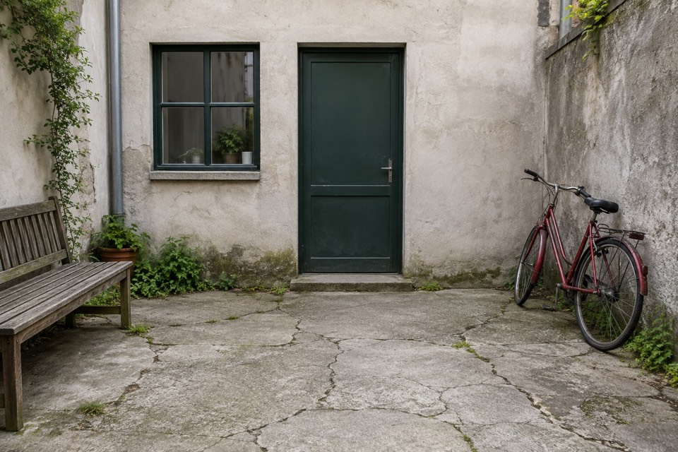
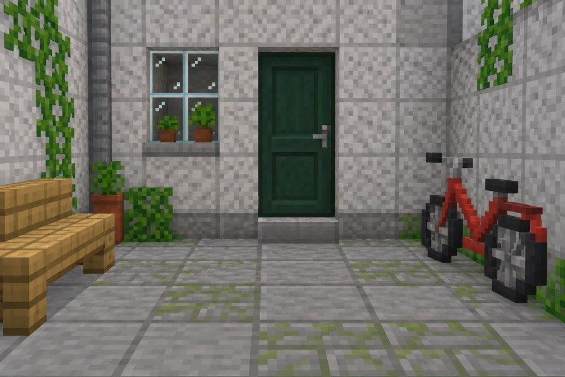
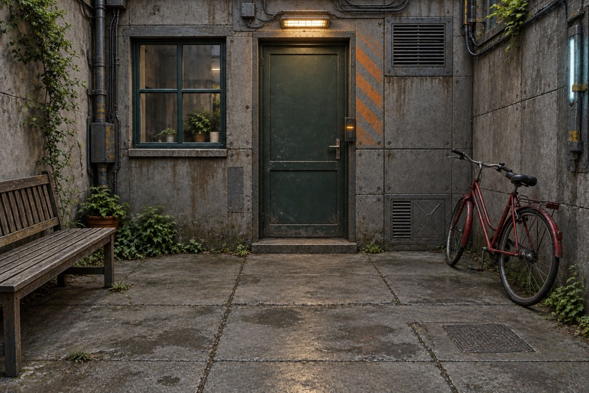
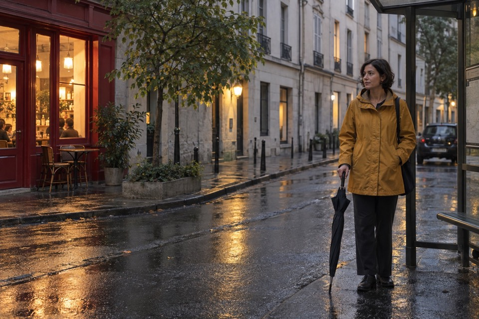
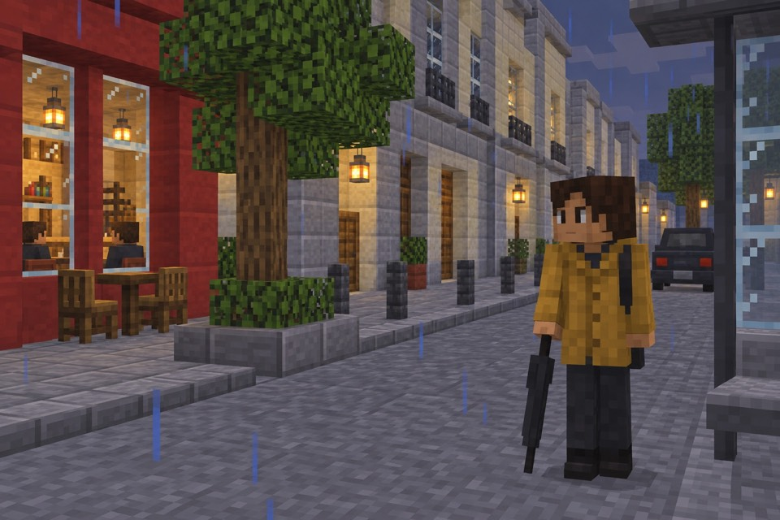
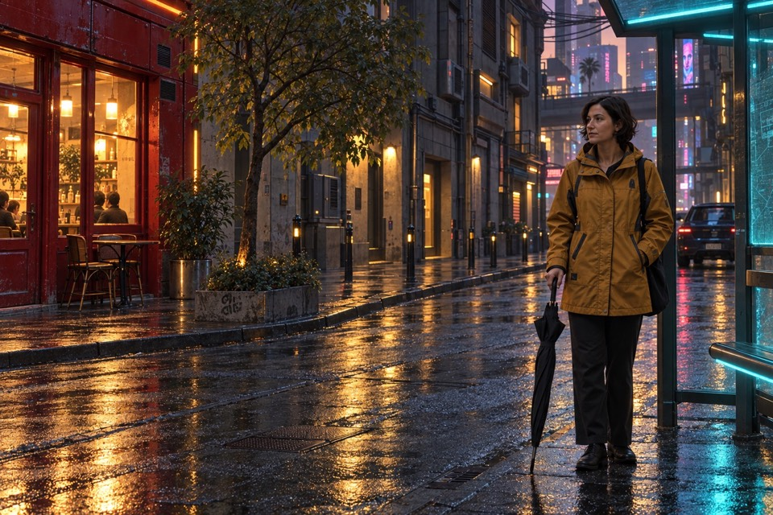

# Game Photo Mode

Turn a place you photographed into another game world.

An image-editing Skill that preserves the scene's subjects and layout while rebuilding geometry, materials and light. Version 1 includes Minecraft default-texture block-world rendering and Cyberpunk 2077-like environmental rendering.

[中文](README.md) · [Download Skill](packages/game-photo-mode-v1.0.0.zip) · [Evaluation record](evals/README.md) · [Interactive comparison](docs/index.html)

| Original | Minecraft | Cyberpunk 2077 |
| --- | --- | --- |
|  |  |  |
|  |  |  |

All inputs and outputs are AI-generated demonstration assets, not private photographs or actual game captures. Each output used its original as the actual edit input. Published previews are resized JPEGs. Exact prompts and rejected attempts are retained in [evals](evals/README.md).

After downloading the repository, open `docs/index.html` offline to switch scenes and presets and move the before/after divider.

## Use

Extract the archive and place `game-photo-mode` in your host's Skills directory. For Codex this is usually `~/.codex/skills/`, or the `skills/` directory under `CODEX_HOME` when configured. Reload Skills, attach a photo or supply its local path, then ask:

```text
$game-photo-mode Rebuild this photo as a Minecraft scene; keep the layout and the person's position.
```

```text
$game-photo-mode Give this photo a Cyberpunk 2077 in-game look; preserve the face, outfit colours and time of day.
```

The host must have an image editor that accepts the source image. Codex uses its built-in image tool by default; the Skill itself needs no API key. Other hosts supply their own editor and model access. A text-only host can prepare an edit prompt but cannot return transformed pixels. This is a portable instruction package, not a standalone offline image filter.

## Rendering choices

Minecraft uses coarse cuboid construction, square low-resolution block-face texels, block foliage and player-like characters. The baseline aims at simple vanilla-style lighting rather than shader reflections. Fine facial identity becomes coarse skin, hair, outfit and pose cues. Props absent from vanilla Minecraft become artistic block-built equivalents, not supposedly native items.

Cyberpunk chooses its material language from the source scene. A modest courtyard stays in daylight with utilitarian concrete and service metal; a wet street uses source-linked warm and cool light. Current examples cover Entropism with restrained Kitsch accents. The other official design languages are documented guidance, not separately demonstrated modes.

The Skill compares composition, subject, geometry, materials and light, then makes targeted repairs when needed. Originals and previous output versions are preserved. See the [entrypoint](skills/game-photo-mode/SKILL.md) and [review criteria](skills/game-photo-mode/references/review.md).

## Evidence and scope

Seven actual image-input edits across two scene types produced four selected outputs and three retained rejected attempts. The format validator, internal references and extracted standalone package were checked. This is a small visual review by the creating assistant, not a representative benchmark, an independent human review or a numerical game-fidelity certification.

Outputs are stochastic. Exact game rendering, faces and pixel preservation are not guaranteed; complex hands, text, crowds and close-up faces are not evaluated here. No meshes, maps, texture packs or playable scenes are exported. [Future directions](docs/research/next-games.md) are explicitly unvalidated.

The earlier [Source Engine Photo](https://github.com/jesui4wendi/source-engine-photo-skill) remains independent. New recipes should include authoritative visual references, actual edits of at least two different scene types, failures, prompts and result images.

## License

Instructions, documentation and project-generated examples use [MIT](LICENSE). No extracted game assets are included. Game names describe visual targets; this project is unaffiliated with Mojang, Microsoft or CD PROJEKT RED. The license does not grant third-party game-asset or trademark rights.
